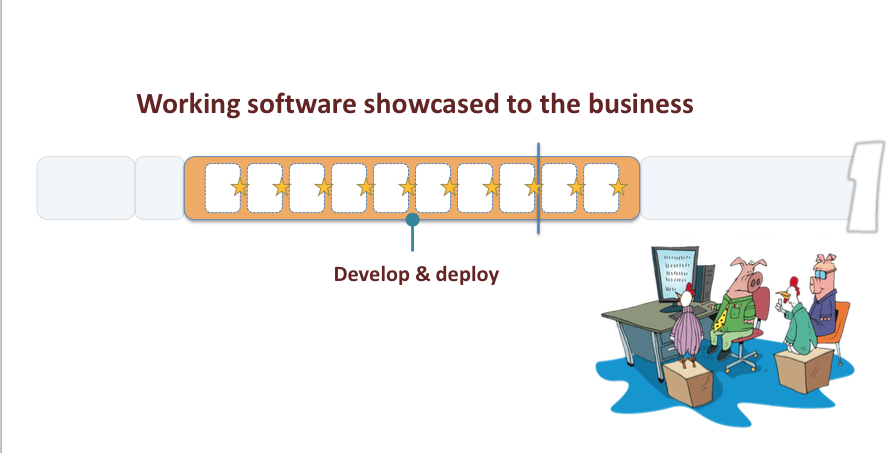

## Day outline

* Lecture - learn the issues that drive the tools
* Docker 101 in one hour (fingers crossed)
* Hands on - how to deploy the same app across three different platforms
  1. Local app deploy
  2. Docker app deploy
  3. PWS app deploy

##NOTE --> We will be installing nearly everything ourselves.  With limited bandwidth we may face delays for downloads . . . this is expected and OK.  It's more important for everyone to get an actual feel for what actually happens in devop daily ops.  This can only be done at the keyboard.

* Class prep on your VM
  * log into your VM via SSH -
      * PuTTY - in the hostname or IP box type <emcse@{ip adress of assigned server}
      * OSX - open a terminal windows and type ssh emcse@{ip address of assigned server} - - - ahhh the power of an actual UNIX under the hood makes me smile
      * the password is emcse
  * Flip over to root (bad idea in the real world - but hey this is class right?) <su root> password emcse
  * Update your server.  If we don't do this we risk getting out of date packages from apt. If you've never used a package manager your in for a real treat her folks <apt-get update && apt-get upgrade>
  * Install Git - more on this later <apt-get -y install git>
  * Git (yes it's a pun) the course materials - <git clone https://github.com/disconnector/devop-day.git>
  * When it finishes <ls> the directory you're in and voila! there are the course materials.  Use <ls> and <cd> to look around

* Class prep on your laptop
  * You do have a Github account right?
  * Open up https://github.com/disconnector/ and check out the repos.  
  * Click on the "devop-day" repo
  * Click on the "Download ZIP" button and unzip the class materials somewhere convenient.
  * Of course if you already know git then cowboy up

---

##Part 1 - DevOps in a nutshell

1. Why all of this DevOps stuff?  What changed?
  * The big question - How do applications actually get from dev laptops to production?
  * Pets versus Cattle

  * Agile development (with thanks to Matt and Jonas)

#Why Agile?

  * Too many projects not delivered
  * Software taking too long to get to market
  * Requirements not met
  * High costs to make changes after delivery
  * Having to “get it right” first time/up front
  *  Too many defects
  * Unhappy Customers
  * Unhappy Developers

  # Software Development Methodologies
  * "Code-fix” (or no process)
  * Structured, heavy weight methodologies a.k.a.
  “Plan Driven Methodologies” and “Waterfall”

  ---
  # Software Development Methodologies (cont)

  * Largely influenced by _traditional engineering_ and _quality processes_ in industries
  * Desire to make software development more _predictable_, _measurable_ and _efficient_
  * Strong emphasis on _detailed planning_ and then _executing to the plan_

  ---

  # But Software is Different

  * Is not Tangible
  * Is not based on Mathematics
  * Needs Knowledge Workers

  ---

  # Relevance
  ###Heavy weight methodologies are most successful when:

   - Requirements are stable
   - Technology is well known and mature
   - Everything happens as one would expect
   - We are not taking on anything new or unknown
   - Coding is ‘copy and paste’

  ---

  # That's not true for most projects though

  ---

  # Projects with these characteristics are few and far between

  Heavy weight methodologies work in some instances, but there are high costs, and the risk in using them in dynamic environments is high.

  ---

  # Origins Of Agile

  ###Agile Methods are a reaction to:

  * Rigidity of heavy weight methods
  * Bureaucracy introduced by heavy weight methods
  * Unpleasant surprises due to lack of visibility
  * **The myth that a well defined process is more valuable than the people who use it**

  ---

  # Agile Follows Systems Thinking
  * System Thinking is a way of looking at how things influence each other as a whole and not as individual parts
  * Focus on Flow, not Function
  * Look at the end-to-end process and the value we deliver to our customers
    * What do our customers value
    * How do we respond to the demands from our customers, as a system

  ---

  # Agile Follows Lean Thinking
  * Add nothing but value (eliminate waste)
  * Flow value from demand (delay commitment)
  * Minimize inventory (minimize intermediate artifacts)
  * Optimize across the organization

  ---

  # The Agile Manifesto

  ---

  >We are uncovering better ways of developing software by doing it and helping others do it. Through this work we have come to value:

  * Individuals and interactions over processes and tools
  * Working software over comprehensive documentation
  * Customer collaboration over contract negotiation
  * Responding to change over following a plan.

  >That is, while there is value in the items on the right, we value the items on the left more.

  ---

  #12 Principles of Agile

  * Our highest priority is to satisfy the customer through early and continuous delivery of valuable software.
  * Welcome changing requirements, even late in development.
  * Deliver working software frequently, with a preference to the shorter timescale.

  ---

  #12 Principles of Agile (cont)

  * Business people and developers must work together throughout the project.
  * Build projects around motivated individuals. Give them the environment and support they need, and trust them to get the job done.
  * The most efficient and effective method of conveying information is face-to-face conversation.

  ---

  #12 Principles of Agile (cont)

  * Working software is the primary measure of progress.
  * Agile processes promote sustainable development. The sponsors, developers, and users should be able to maintain a constant pace indefinitely.
  * Continuous attention to technical excellence and good design enhances agility.

  ---

  #12 Principles of Agile (cont)

  * Simplicity - the art of maximizing the amount of work not done - is essential.
  * The best architectures, requirements, and designs emerge from self-organizing teams.
  * At regular intervals, the team reflects on how to become more effective, then tunes and adjusts its behaviour accordingly.

  ---

  # Timeboxing

  Timeboxing is used as a project planning technique.

  The schedule is divided into a number of separate time periods (timeboxes), with each part having its own deliverables, deadline and budget.

  ---

  # Without Timeboxing

  Without timeboxing, projects usually work to a fixed scope

  When it is clear that some deliverables cannot be completed, either the deadline slips (to allow more time) or more people are involved (to do more in the same time)

  Usually both happen, delivery is late, costs go up, and often quality suffers

  ---

  # With Timeboxing

  With timeboxing, the deadline is fixed but the scope may be reduced

  Work focuses on the most important deliverables

  For this reason, timeboxing depends on the prioritization of deliverables to ensure that it is the project stakeholders who determine the important deliverables rather than software developers

  ---

  #Agile Project Lifecycle
  ## Timeboxed iterations
  

  ---

  # The Basics
  

  ---

  # Lifecycle

  

  ---

  # Iterative

  

  ---

  # Incremental

  

  ---

  # Minimum Viable Product (MVP)

  

  ---

  # Agile Myths

  * No Planning
  * No Documentation
  * Lacks Discipline
  * Limited to Co-Located Teams
  * Open Ended

  ---

  #Agile Roles

  ---

  # Product Owner

  The one person responsible for a project’s success

  The Product Owner leads the development effort by conveying his or her vision to the team, outlining work in the scrum backlog, and prioritizing it based on business value

  Determines what needs to be built in 30 days or less

  ---

  # Development Teams

  Those responsible for committing work to the project

  Builds what is needed in 30 days or less and then demos it

  Based on the demo the Product Owner determines what to build next

  ---

  # Scrum Master
  Serves as a facilitator for both the Product Owner and the team

  He or she has no management authority within the team and may never commit to work on behalf of the team

---

2. Deployment options - VMs, unikernel, containers, and PaaS

  * VMs - full implementation of an OS
    * maximum isolation (outside of physical)
    * least efficient resource utilization
    * More to manage than before
    * Really made for pets

  * Unikernel - just the basics
    * absolute minimum install to support app
    * Kernels are modularized
    * Isolation of a VM, but much lower utilization
    * Not as common and requires deeper knowledge to operate

  * Containers (Docker) - app isolation in usermode
    * userspace and some kernel isolation
    * most effective resource utilization (only use resources of app)
    * PORTABILITY AND REPEATABILITY
    * Management burden shifts to containers
      * Networking difficulties
      * Keeping track of cattle

  * PaaS - who cares about all of the stuff?  Let's just code!
    * No (or minimal) concern for infrastructure
    * PaaS requires a different mindset
      * Limited Frameworks
      * Toolsets
      * Networking
      * Upload code and go
---
    # DevOp tools
      Languages
      * Compiled
        * machine code is created for the specific platform
        * Main advantage is speed / disadvantage is portability
        * If the machine platform is correct - no dependencies (most of the time)
        * C, C++, Golang
      * Interpreted
        * compiled at run time or via an intermediate representation
        * Main advantage is portability / disadvantage is speed
        * Require dependancies if no packaging engine is used (pip for example)
        * Java, Python, Ruby, .NET

    # Frameworks
      * Frameworks allow
---    
    # Source control with Git
      * How do you keep track of a project with many developers working on small pieces of a larger whole?
      * How do you revert versions of code across many developers in sync?
      * You use a *version control system*
      * Examples are Subversion, CVS, Mercurial, Git, etc etc
        *  GitHub is a public (or private!) code repository with version control
          * Commit
          * Push
          * Checkout
          * Clone
          * Branch
          * Commit
----
    # Vagrant
      * Creates and configures virtual environments
      * Why?
        * Developers like to develop locally - but distributing an entire VM is hard
        * Everyone needs to have the *exact* same environment to code
        * Define base "box" and all configuration via a text file (Vagrantfile)
        * Example Vagrantfile
        * Vagrant up
        * Vagrant ssh
---
    # Cloud Foundry - (with thanks to Matt Cowger and Jonas Rosland)
      * PaaS is a category of cloud computing services that provides a platform allowing customers to develop, run and manage applications without the complexity of building and maintaining the infrastructure typically associated with developing and launching an app.

    # CF 101

    >what problems does it solve?

    * managing operating systems sucks.
    * managing runtimes sucks
    * managing deployment of dependencies sucks
    * managing application isolation sucks
    * managing deployment tasks sucks

    ## Process for deploying/scaling app on EC2 / EHC / etc

    1. Deploy VM (the easy part - handled by IaaS...CMDB?)
    2. Secure VM (or write some puppet)
    2. Install runtime (with what?  rpm?  tarball?)
    3. install dependencies (or write some scripts)
    4. Install application (tarball? RPM? git?)
    5. Start application (how?  job engine?  keep it running?)
    6. Modify load balancer (how?)
    7. Modify firewall (how?)
    8. Add health checks (to where?  http? tcp? )

    ## Process for deploying app on CF

    1. `cf push app_name`

    ## Process for scaling app on CF

    1. `cf scale app_name -i instance_count`
---    
  * Markdown
    * What this doc is written in :-)
    * Quick and easy way to generate formatted docs for people who hate writing docs.  IT uses a text to html conversion process - write in text with MD, get webpages.
    * Check out the Chrome extension "Markdown Preview Plus"
---    
  * A good text editor
    * Atom or Sublime Text highly recommended
---

3. Docker 101 in 1 hour with hands on
  * Why Docker?
  * Docker install
  * Docker basic commands
  * Have class download ubuntu:latest image to save time later
  * Docker management via Mesos, Kubernetes

---

#Part 2 - hands on app deploy

---

  # Deploying an app the old school way
    * This is all done on your Linux VM.  Make sure you're <su root>.  Otherwise add <sudo> to every command
    * Install dependencies
      * we're making this easy ok?
      * Install python packaging tool <apt-get install python-pip>
        * Observe the dozens of dependancies that are installed . . . sheesh!
      * Install the Flask framework <pip install flask>
        * Even more dependancies - and every one has a version number <shiver>
    * Get code from github
      * You already have this right?
    * Examine and update code
      * cd to devop_day/local_code
      * Notice this is very simple - just one Python script that calls one framework
      * Open hello-python.py in a text editor and change the {myname="Rich Barlow"} line to be your name
    * Run the code
      * While in the directory that contains the "hello-python.py" code, type <python hello-python.py>
      * You should see lines of code scroll by with the final line looking something like:
        <Running on http://0.0.0.0:5000/ (Press CTRL+C to quit)>
        If not please let me know  . . .
    * See it running
      * open your web browswer and got to http://{ip address of VM}:5000

    ## Why is this hard?
    * Dependencies from hell
    * Versioning
    * What happens as the code AND the infrastructure get updated?
    * How much time does it take to build a server?  Errors?  Ouch
---
  # Deploying an app via Docker
    * Build container
      * in directory with Dockerfile type <docker build -t simple_local_app .> <-- THE TRAILING PERIOD IS NEEDED!!
      * This will build a local container that we can run later
    * Run container
      * run <docker images> to see if the container "simple_local_app" has been created
      * Type <docker run -it -p 5000:5000 --name container_instance simple_local_app
    * See it running!
      * Open a web browser and go to http://{ip address of VM}:5000
    * Clean up a bit for next part
      * type <docker ps> to see running containers
      * Type <docker kill {container name}> to free up port 5000

  # Deploying a pre-built Docker container
    * Pull down a simple container that I have out at Docker Hub
      * type <docker pull disconnector/devop_day>
    * Spin up a running container
      * type <docker run -it -p 5000:5000 --name simple_remote_app disconnector/devop_day>
      * Watch as it spins up . . .
      * See it running!
        * Open a web browser and go to http://{ip address of VM}:5000 . . . That's a nice eggplant color isn't it?

    * Clean up
      * type <docker ps> to see running containers
      * Use <docker kill {container id}> to kill anything running
---
  # Deploying an app via PWS/PCF
    * Be sure you've Git cloned the class repo to your laptop as in the class prep
    * Download the PWS toolset
      * Go to https://console.run.pivotal.io/tools and download the correct version for your local OS
      * Install it.  Duh
      * Connect to PWS
      * @ CLI - <cf login -a https://api.run.pivotal.io>  Enter username and password
      * Examine the output - you should be in the "EVP" org and "EMC" space.  If not please speak up.
      * type <cf help> for a list of commands
    * Examine files
      * Open local code under cf in git download
        * hello-idiomatic.py - main code we are running on the back end.  Replace my name with yours . . . if you know Flask feel free to add variables and/or play
        * templates/index.html - rendered webpage that reads variables from code.  Remember code-behind pages in ASP.net?  HAHAHAHAHAAA
        * mainfest.yml - (YAML file - data oriented markup language) - settings for the "push".  Replace the ${random-word} with your last name and year of birth.  hello-python-barlow70 for example
        * requirements.txt - what are the required frameworks for the code
    * Run Code
      * in CLI while in cf directory type <cf push>
      * Watch your app magically appear
      * Note the name of the app - when it finished deploying open a webbrowser and go to http://{name of app}.cfapps.io to see the results
    * Profit!
    * Clean up
      * Open PWS console page (https://console.run.pivotal.io) and log in.
      * Check out your running app!
      * Click the far right arrow for details
      * When done - stop your app and delete it
