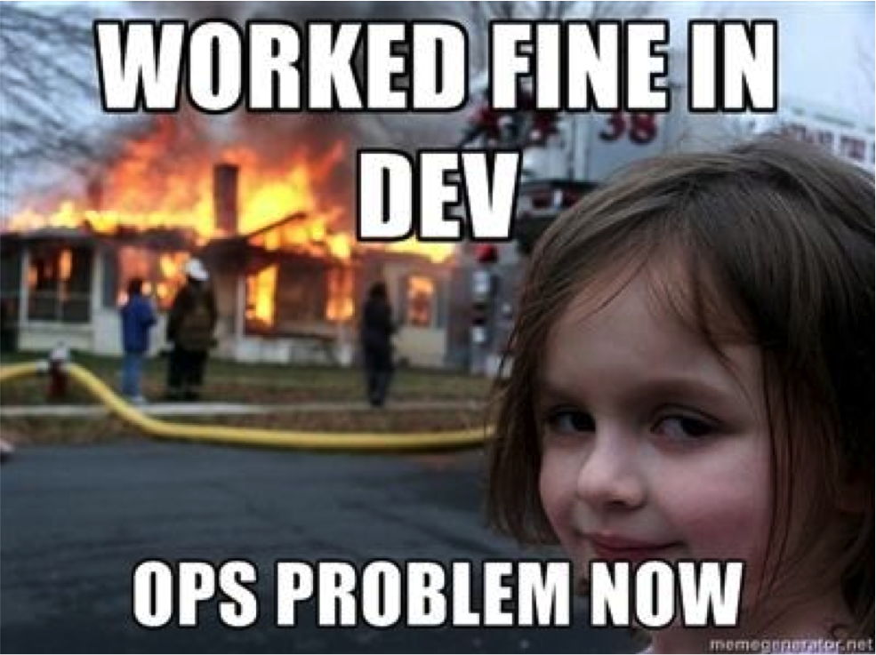
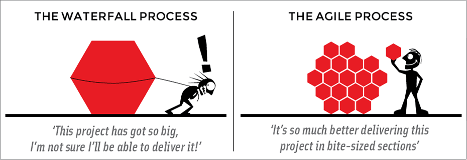
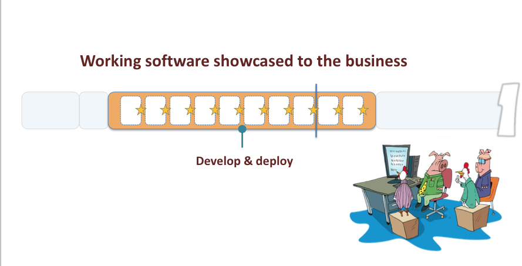
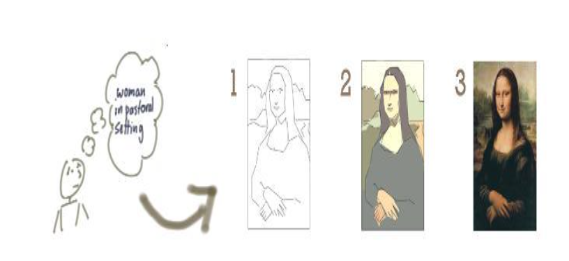
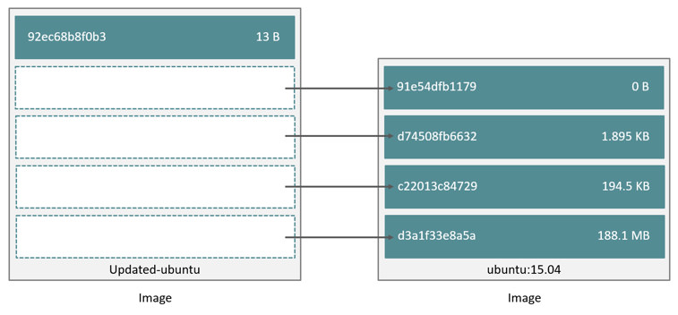

# [fit] DevOps in a nutshell


---

This presentation is written in Github Formatted Markdown.  For best results view in Deskset or the Google Chrome Markdown Preview Plus (or any other MD rendering engine.  Be happy I didn't decide to do Reveal.js ;-)

---

###Many thanks to Matt Cowger and Jonas Rosland for content that I have stolen shamelessly

> Plagiarism is the highest form of compliment and the lowest form of larceny
--Eric Hoffer

---

##The big question - How do applications actually get from dev laptops to production?

>DevOps (a clipped compound of "development" and "operations") is a culture, movement or practice that emphasizes the collaboration and communication of both software developers and other information-technology (IT) professionals while automating the process of software delivery and infrastructure changes. It aims at establishing a culture and environment where building, testing, and releasing software, can happen rapidly, frequently, and more reliably.


---

DevOps requires a new relationship between
##developers (content creators)  
and
##operations (content maintainers)

---

##In the past this was not required
  * Simpler apps
  * Clearly defined opjectives
  * Slow pace of change
  * Infrequent updates

---



---

##What issues do we see?

  * Too many projects not delivered
  * Software taking too long to get to market
  * High costs to make changes after delivery
  * Having to “get it right” first time/up front
  * Unhappy Customers
  * Unhappy Developers

---

##New processes AND tools are being used to fight this problem
* Agile / Lean development process
* New deployment technologies
* New operational software

---
#Why Agile?

* Too many projects not delivered
* Software taking too long to get to market
* High costs to make changes after delivery
* Having to “get it right” first time/up front
* Unhappy Customers
* Unhappy Developers

---

#Agile vs "Lean"

Lean = viable product after every iterations
Agile may not be viable after every iteration

---

# Traditional Software Development Methodologies
  * "Code-fix” (or no process)
  * Structured, heavy weight methodologies a.k.a.
  “Plan Driven Methodologies” and “Waterfall”

---

#Software Development Methodologies (cont)

  * Largely influenced by _traditional engineering_ and _quality processes_ in industries
  * Desire to make software development more _predictable_, _measurable_ and _efficient_
  * Strong emphasis on _detailed planning_ and then _executing to the plan_

---

#But Software is Different

  * Is not Tangible
  * Is not based on Mathematics
  * Needs Knowledge Workers

---


>No plan survives contact with the enemy . . . or the market
-- Larry Page

---

#Relevance
###Heavy weight methodologies are most successful when:

   - Requirements are stable (HAHAHAHAHAHAAA)
   - Technology is well known and mature
   - Everything happens as one would expect
   - We are not taking on anything new or unknown
   - Coding is ‘copy and paste’


---

#That's not true for most projects though

---

##Projects with these characteristics are few and far between

Heavy weight methodologies work in some instances, but there are high costs, and the risk in using them in dynamic environments is high.


---

  * Individuals and interactions over processes and tools
  * Working software over comprehensive documentation
  * Customer collaboration over contract negotiation
  * Responding to change over following a plan.


  >That is, while there is value in the items on the right, we value the items on the left more.

---

  #12 Principles of Agile

  * Our highest priority is to satisfy the customer through early and continuous delivery of valuable software.
  * Welcome changing requirements, even late in development.
  * Deliver working software frequently, with a preference to the shorter timescale.

---

  #12 Principles of Agile (cont)

  * Business people and developers must work together throughout the project.
  * Build projects around motivated individuals. Give them the environment and support they need, and trust them to get the job done.
  * The most efficient and effective method of conveying information is face-to-face conversation.

---

  #12 Principles of Agile (cont)

  * Working software is the primary measure of progress.
  * Agile processes promote sustainable development. The sponsors, developers, and users should be able to maintain a constant pace indefinitely.
  * Continuous attention to technical excellence and good design enhances agility.

---

  #12 Principles of Agile (cont)

  * Simplicity - the art of maximizing the amount of work not done - is essential.
  * The best architectures, requirements, and designs emerge from self-organizing teams.
  * At regular intervals, the team reflects on how to become more effective, then tunes and adjusts its behaviour accordingly.

---

#Timeboxing

  Timeboxing is used as a project planning technique.

  The schedule is divided into a number of separate time periods (timeboxes), with each part having its own deliverables, deadline and budget.

---

# The Basics
  

---

#Lifecycle

  

---

#Iterative - many cycles

  

---

#Incremental - every stage better

  

---

#Minimum Viable Product (MVP)

  

---

#Agile Roles

---

#Product Owner

  The one person responsible for a project’s success

  The Product Owner leads the development effort by conveying his or her vision to the team, outlining work in the scrum backlog, and prioritizing it based on business value

  Determines what needs to be built in 30 days or less

---

#Development Teams

  Those responsible for committing work to the project

  Builds what is needed in 30 days or less and then demos it

  Based on the demo the Product Owner determines what to build next

---

#Scrum Master
  Serves as a facilitator for both the Product Owner and the team

  He or she has no management authority within the team and may never commit to work on behalf of the team

---

# [fit] TOOLS

---

#Traditional apps
##versus
#microservices

---

##Traditional apps are built as one large program

* This makes updating difficult because of tight coupling
* Updates come slowly - one change requires unit testing entire app
* How do you scale one part of the app?
* How do you spread the work over many developers
* Soon hit limits of human mind capacity to understand

---
##Modern apps are built around *microservices*

>Google deploys 2 billion microservices (containers) every week

---

##A microservice is a program that does one and only one thing well

  * Examples - NetFlix, Google, pretty much any modern web app
  * All parts are loosely coupled
  * Communicate using message queues for async coms
  * Allows for scaling at almost any level
  * Encourages stateless behavior
  * As long as the interface doesn't change no testing is required for other components

---

# [fit] PETS VS. CATTLE
  

---

# [fit] VMs
# [fit] Unikernel
# [fit] Containers
# [fit] PaaS

---
# VMs - full implementation of an OS

  * maximum isolation (outside of physical)
  * least efficient resource utilization
  * More to manage than before
  * Really made for pets

---

# Unikernel - just the basics
  * absolute minimum install to support app
  * Kernels are modularized
  * Isolation of a VM, but much lower utilization
  * Not as common and requires deeper knowledge to operate

---

# Containers (Docker) - app isolation in usermode
  * userspace and some kernel isolation
  * most effective resource utilization (only use resources of app)
  * PORTABILITY AND REPEATABILITY
  * Management burden shifts to containers
    * Networking difficulties
    * Keeping track of cattle

---

# PaaS - who cares about all of the stuff?  Let's just code!
  * No (or minimal) concern for infrastructure
  * PaaS requires a different mindset
    * Limited Frameworks
    * Toolsets
    * Networking
    * Upload code and go
---

# [fit] DevOp tools

---

# Languages

---

#Compiled

  * machine code is created for the specific platform
  * Main advantage is speed / disadvantage is portability
  * If the machine platform is correct - no dependencies (most of the time)
  * C, C++, Golang

---

#Interpreted

  * compiled at run time or via an intermediate representation
  * Main advantage is portability / disadvantage is speed
  * Require dependancies if no packaging engine is used (pip for example)
  * Java, Python, Ruby, .NET

---

#This distinction is becoming very blurry :-)

---

# Frameworks
  * Frameworks allow developers to be lazy sods.
  * Instead of writing rewriting an entire web stack in a Ruby project just call Rails
  * We will work with a framework later

---

# Source control with Git
  * How do you keep track of a project with many developers working on small pieces of a larger whole?
  * How do you revert versions of code across many developers in sync?
  * You use a *version control system*
  * Examples are Subversion, CVS, Mercurial, Git, etc etc

---

##Github
  *  GitHub is a public (or private!) code repository with version control
  * Push, commit, checkout, clone, fork code . . . from anywhere in the world
  * Private repos available

  Demo with Github.com

----
# Vagrant
  * Creates and configures virtual environments
  * Why?
    * Developers like to develop locally - but distributing an entire VM is hard
    * Everyone needs to have the *exact* same environment to code

---

# Vagrant
  * Define base "box" and all configuration via a text file (Vagrantfile)
  * Example Vagrantfile
  * Vagrant up
  * Vagrant ssh

    Vagrant demo - if time install locally (http://rigel.local:8000 after I start SimpleHTTPServer)

---

# Cloud Foundry - (with thanks to Matt Cowger and Jonas Rosland)
  * PaaS is a category of cloud computing services that provides a platform allowing customers to develop, run and manage applications without the complexity of building and maintaining the infrastructure typically associated with developing and launching an app.

---

# CF 101

    >what problems does it solve?

    * managing operating systems sucks.
    * managing runtimes sucks
    * managing deployment of dependencies sucks
    * managing application isolation sucks
    * managing deployment tasks sucks

---

## Process for deploying/scaling app on EC2 / EHC / etc

    1. Deploy VM (the easy part - handled by IaaS...CMDB?)
    2. Secure VM (or write some puppet)
    2. Install runtime (with what?  rpm?  tarball?)
    3. install dependencies (or write some scripts)
    4. Install application (tarball? RPM? git?)
    5. Start application (how?  job engine?  keep it running?)
    6. Modify load balancer (how?)
    7. Modify firewall (how?)
    8. Add health checks (to where?  http? tcp? )

---

## Process for deploying app on CF

`cf push app_name`

---

## Process for scaling app on CF

`cf scale app_name -i instance_count`

---    

#Markdown
  * What this doc is written in :-)
  * Quick and easy way to generate formatted docs for people who hate writing docs.  It uses a text to html conversion process - write in text with MD, get webpages.
  * Check out the Chrome extension "Markdown Preview Plus"

---    

# A good text editor
  * Atom or Sublime Text highly recommended
  * Notepad++ on Windows

---

## Docker 101
  * Why Docker? - **see PPTX**
  * Docker file system - AUFS, btrfs, or devicemapper
    * take several directories and present them as a single filesystem via union mount
    * Uses Copy-on-write on a per file or per block basis
    * All *image* layers are read-only
    * The top *container* layer is read-write

---


---

##Docker is space efficient


---

  * Docker install
    * Log into your VM
    * <su root> . . . duhhhh
    * Type <apt-get install docker.io>.  Watch the magic baby!

---

###Docker basic commands
Type <docker help> to get  list of commands

```bash

docker pull - pull image from repository
docker build - create container image
docker run - run container
docker attach - connect to running container
docker search - search contents of a repository
docker ps - see running containers (-a lists running and stopped)
docker images - see local images
docker history - see layers in image

```

---

##Let's search Docker Hub

```bash
  First su root (yep . . . lazy)
  docker search ubuntu
  docker search hashicorp
  docker search tomcat
  ```

---

##Pull an image


```bash
  docker pull ubuntu
```

This is a good time for a break :-)

---

##List local images

```bash
docker images
```

---

##Build a container

Dockerfile - a simple text file that defines a container

Let's use a simple text editor to build a quick one in your VM

```bash
su root
mkdir docker
cd docker
nano Dockerfile
```

---

##Contents

```
FROM ubuntu
MAINTAINER {yourself}
RUN apt-get update
RUN apt-get -y install python

ctrl-X to save

```

---

#Create the container

While in directory with Dockerfile

```bash
docker build -t simple_container .
```

##See your new container

```bash
docker images
```

---

##See layers in image

```bash
docker history simple_container
```

---

##Run the container

```bash
docker run -it -p 8000:8000 -name running_container simple_container /bin/bash
```

```bash
@container prompt
ifconfig
python -m SimpleHTTPServer
```

Check it out from your base system

---
##Other tools
```
Docker Swarm - native Docker clustering
Kubernetes - Google's Docker clustering engine
Apache Mesos - Docker container automation
Flocker - COntainer orchestration
EMC RexRay - Persistent container storage
EMC - many extensions for our arrays
```
---

#Hello Class!

---
